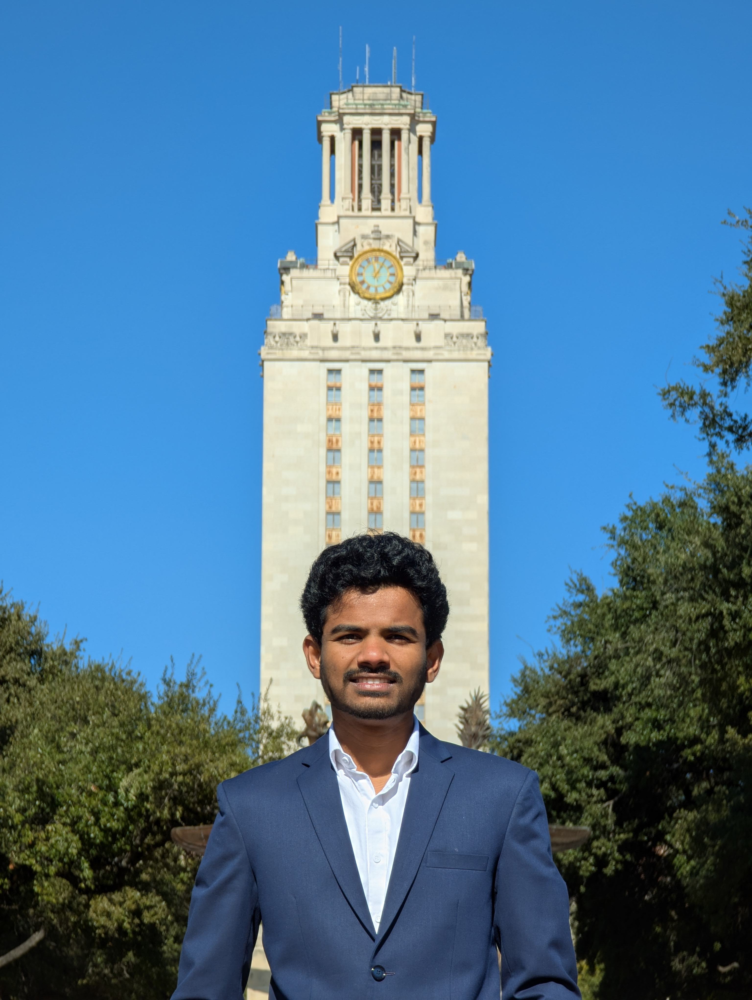

  

    
  

  

    
<b>Ganesh Borde, MS</b>

    
<a href="https://utexas.edu" target="blank">The University of Texas at Austin</a>

    
<a href="files/GaneshBorde_cv.pdf">Curriculum Vitae</a>

  

I obtained my Master of Science in Aerospace Engineering from [The University of Texas at Austin](http://emory.edu/) in December 2024, specializing in Aerothermodynamics. My research during the M.S. program was conducted under the guidance of [Dr. Fabrizio Bisetti](https://www.ae.utexas.edu/people/faculty/faculty-directory/bisetti) in the Reactive Flow Modeling Laboratory. The focus of my research was to create a framework for calculating flame properties such as flame speed, Markstein length, and flame thickness using a 1D cylindrical outward propagating flame model, instead of the spherical outward propagating flame, which is 3D and computationally expensive to simulate.

Along with my research, I also served as a Teaching Assistant for the Mathematics and Physics departments at the [College of Natural Sciences](https://cns.utexas.edu/), assisting in courses like Differential Calculus, Differential and Integral Calculus for Business, and Physics Lab. My role involved facilitating decision sessions to help students with problem-solving and addressing conceptual gaps.

My coursework included Compressible Flow, Viscous Flow, CFD, Dynamics of Turbulent Flow, Applied Numerical Mathematics, Advanced Plasma, Combustion, Molecular Gas Dynamics, Computational Methods, and Hypersonic Aerodynamics.

I completed my Bachelor of Technology (B.Tech) in Aeronautical Engineering from [Vel Tech Rangarajan Dr. Sagunthala R&D Institute of Science and Technology](https://www.veltech.edu.in/) in June 2022. For my final-year project, I worked on designing a scramjet inlet for shock-lip under the supervision of [Dr. Naren Shankar](https://scholar.google.com/citations?user=BFDpCJ4AAAAJ&hl=en), and I presented the work at [ICES 2022](https://ices.space/). In addition to my final project, I also worked on the design and analysis of a small-scale axial flow pump impeller. Most of my coursework focused on topics related to Aerothermodynamics, including courses in Aerodynamics, Fluid Mechanics, Intro to CFD, Python Programming, Thermodynamics, FEA, and Propulsion.

More about my [projects](#) and [research](#) is available on this website.
